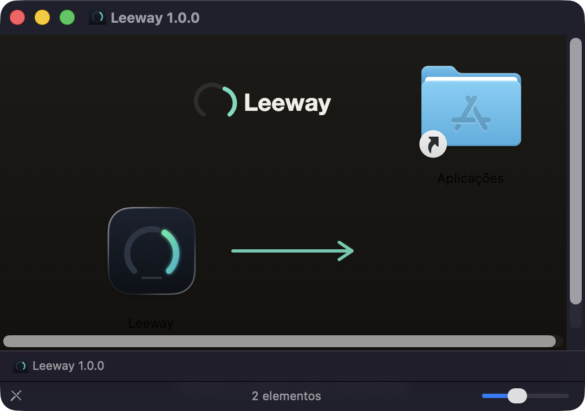
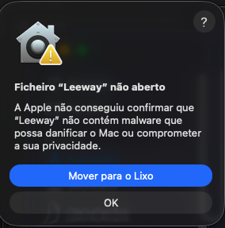
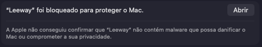
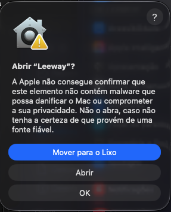
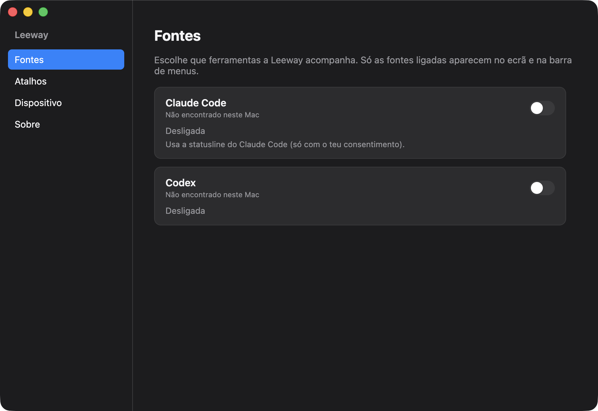
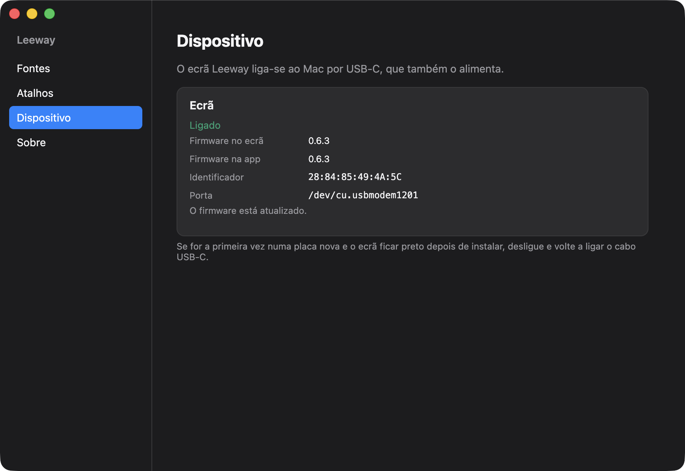

# Leeway

A Leeway mostra, num pequeno ecrã ao lado do Mac, quanto já usaste do Claude Code e do Codex e quando
os limites voltam a zero. O ecrã também tem atalhos: tocas num botão e o Mac abre uma app ou corre um atalho.

Desenvolvido por [NodeGrid.dev](https://nodegrid.dev).

Este guia leva-te do download até veres o uso no ecrã. Demora uns 5 minutos.

### [⬇️ Descarregar a Leeway para Mac](https://github.com/andresousa6/leeway/releases/latest/download/Leeway-arm64.dmg)

Última versão, para Mac com Apple Silicon. [Novidades de cada versão](https://github.com/andresousa6/leeway/releases).

## Do que precisas

- Um Mac com **Apple Silicon** (M1 ou mais recente) e **macOS 15** ou mais recente.
- O ecrã Leeway.
- Um cabo **USB-C de dados**. Alguns cabos só servem para carregar: com esses o Mac não vê o ecrã.
- O Claude Code e/ou o Codex instalados e já usados neste Mac.

## 1. Descarregar

Carrega em [**Descarregar a Leeway para Mac**](https://github.com/andresousa6/leeway/releases/latest/download/Leeway-arm64.dmg). O ficheiro `Leeway-arm64.dmg` fica na pasta
Transferências: abre-o com dois cliques.

## 2. Instalar

Arrasta a Leeway para a pasta **Aplicações**. Depois podes ejetar o `.dmg`.

## 3. Autorizar a primeira abertura

A Leeway é uma app pequena, feita para amigos, e não passa pela verificação paga da Apple. Por isso, da
primeira vez, o macOS bloqueia-a. É normal e só acontece uma vez.

1. Abre a Leeway em Aplicações. Aparece este aviso: carrega em **OK** (não em "Mover para o Lixo").

   

2. Abre **Definições do Sistema > Privacidade e Segurança** e desce até ao fim. Ao lado de
   "Leeway foi bloqueado para proteger o Mac", carrega em **Abrir** (em algumas versões diz
   **Abrir mesmo assim**). O Mac pode pedir a tua palavra-passe ou o Touch ID.

   

3. Confirma com **Abrir**.

   

A partir daqui a Leeway abre normalmente.

## 4. Escolher as fontes

Da primeira vez, a Leeway abre no separador **Fontes**. Liga as ferramentas que usas:

- **Codex:** basta ligar.
- **Claude Code:** ao ligar, a Leeway mostra a alteração que vai fazer à *statusline* do Claude Code (é por
  aí que o Claude Code lhe passa os valores de uso). Só muda depois de confirmares. Para ver o uso do Claude,
  usa o Claude Code uma vez depois disto.

> Se uma ferramenta aparece como "Não encontrado neste Mac", é porque ainda não foi usada aqui. Usa-a uma
> vez e volta a este separador.

A Leeway fica na **barra de menus** (em cima, à direita). As definições abrem-se a partir daí.

## 5. Ligar o ecrã e instalar o firmware

1. Liga o ecrã ao Mac com o cabo USB-C. O cabo também o alimenta.
2. Na Leeway, abre o separador **Dispositivo**.
3. Se o ecrã for novo, aparece o botão **Instalar firmware** (ou **Atualizar para…**, se já tiver uma versão
   antiga). Carrega e confirma. Demora uns 10 segundos. **Não desligues o cabo durante a gravação.**
4. No fim, o estado passa a **Ligado** e aparece "O firmware está atualizado".

Pronto. O ecrã mostra o uso de cada ferramenta. Desliza para o lado para ver os **Atalhos**, que configuras
no separador **Atalhos** da app.

## Se algo correr mal

**O ecrã ficou preto depois de instalar o firmware pela primeira vez.**
Desliga o cabo USB-C e volta a ligá-lo. Numa placa nova, isto costuma ser preciso uma vez.

**"A porta do ecrã está ocupada por outra app".**
Há outro programa a usar o ecrã (por exemplo, o Arduino IDE ou um monitor série). Fecha-o e tenta de novo.

**A Leeway diz "À procura do ecrã" com o cabo ligado.**
Provavelmente o cabo só carrega. Experimenta outro cabo USB-C, de preferência o que veio com o ecrã. Liga-o
diretamente ao Mac, sem hub.

**A gravação parou a meio ("O ecrã desligou-se a meio da gravação" ou "O ecrã não respondeu").**
Volta a ligar o cabo e carrega outra vez em **Instalar firmware**. Repetir a gravação não estraga o ecrã.

**Toco no Claude Code no ecrã e o Terminal não abre.**
Da primeira vez, o macOS pergunta se a Leeway pode controlar o Terminal. Se recusaste, vai a
**Definições do Sistema > Privacidade e Segurança > Automação**, procura a Leeway e liga o **Terminal**.

**O ecrã mostra os valores esbatidos, com "há X min".**
São os últimos valores conhecidos. Atualizam-se na próxima vez que usares a ferramenta.

## Privacidade

- Tudo acontece **no teu Mac**. A Leeway não tem contas, servidores nem estatísticas de uso.
- Lê apenas os ficheiros locais do Codex e o que o Claude Code lhe passa pela *statusline*, e esta última só
  depois de autorizares no passo 4.
- O ecrã recebe os valores pelo cabo USB-C e mais nada.
- O **único acesso à internet** é a verificação de atualizações: uma vez por dia, a Leeway pergunta ao GitHub
  se há uma versão nova. Podes desligá-la em **Sobre > Atualizações**. As atualizações nunca se instalam
  sozinhas: a Leeway apenas avisa e abre a página de download.

## Atualizar

Quando há uma versão nova, aparece **Atualização disponível** no menu da Leeway e em **Sobre**. Descarrega o
novo `.dmg` e arrasta a Leeway para Aplicações outra vez, substituindo a antiga. As tuas definições mantêm-se.
Se a versão nova trouxer firmware novo, o separador **Dispositivo** mostra **Atualizar para…**.
